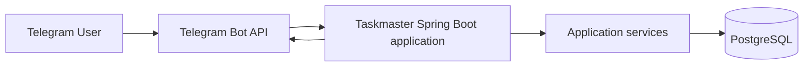
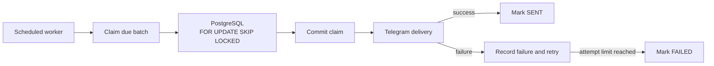

# Taskmaster Bot

Taskmaster Bot is a production-oriented Telegram task manager built with Java 21,
Spring Boot, and PostgreSQL. It provides a guided task-creation conversation,
paginated task management, status tracking, user-specific statistics, safe
deletion, and persistent deadline reminders.

The project demonstrates clean separation between Telegram interaction,
application services, persistence, scheduling, and infrastructure. It is designed
as a portfolio project and as a practical foundation for further development.

## Key features

- Telegram long-polling bot with `/start`, `/help`, and `/cancel`
- Reply-keyboard main menu and validated task-creation FSM
- PostgreSQL persistence with strict Telegram-user ownership isolation
- Paginated active-task listing with inline navigation
- Task details and `TODO → IN_PROGRESS → COMPLETED` transitions
- Confirmed single-task and bulk deletion
- User-specific task statistics
- Persistent 24-hour, 1-hour, and deadline-time reminders
- Retryable reminder delivery with PostgreSQL multi-instance locking
- Optimistic locking for concurrent task updates
- Flyway-managed schema and Hibernate schema validation
- Unit and Testcontainers-backed PostgreSQL integration tests
- Multi-stage, non-root Docker image and Docker Compose environment

## Technology stack

| Area | Technology |
|---|---|
| Language | Java 21 |
| Application | Spring Boot 4.1 |
| Telegram | TelegramBots API 10.1, long polling |
| Persistence | Spring Data JPA, Hibernate, PostgreSQL 17 |
| Migrations | Flyway |
| Build | Maven Wrapper |
| Testing | JUnit 5, AssertJ, Mockito, Testcontainers |
| Operations | Docker, Docker Compose, Spring Boot Actuator |

## Architecture



Telegram update handling remains in the `bot` package. Business transactions,
ownership checks, task operations, statistics, and reminder coordination live in
services. Repositories are never accessed directly by the Telegram adapter.

```text
com.github.taskmasterbot
├── bot          Telegram update routing, keyboards, callbacks, formatters
├── config       Typed configuration and infrastructure beans
├── controller   Minimal HTTP operational endpoints
├── dto          Application boundary records
├── entity       JPA entities and domain enums
├── repository   Spring Data repositories and aggregate projections
└── service      Task use cases, reminder claiming, retries, scheduling
```

## Database migrations

Flyway migrations are stored in
`src/main/resources/db/migration`:

| Version | Purpose |
|---|---|
| V1 | Create `telegram_users` and `tasks`, constraints, indexes, and ownership relationship |
| V2 | Add the task optimistic-lock `version` column |
| V3 | Create persistent `task_reminders`, retry fields, constraints, and indexes |

Hibernate uses `ddl-auto: validate`; it validates the Flyway-managed schema but
does not generate or modify it.

## Reminder architecture



Task creation stores only reminder times that have not already passed. A unique
constraint on `(task_id, reminder_type)` prevents duplicate records. Workers
claim at most the configured batch size and commit before calling Telegram, so
database transactions are not held open during network I/O.

Completing a task cancels pending reminders. Task deletion uses database cascade
deletion, including bulk task deletion. Reminder state and retry metadata survive
application restarts.

## Prerequisites

For local Maven startup:

- Java 21
- Docker with Docker Compose

For complete Docker startup, only Docker with Docker Compose is required. Maven
and Java do not need to be installed on the host because the image is built in a
multi-stage Docker build.

## Telegram BotFather setup

1. Open [BotFather](https://t.me/BotFather) in Telegram.
2. Run `/newbot`.
3. Choose a display name and a unique username ending in `bot`.
4. Copy `.env.example` to `.env`.
5. Put the BotFather token and username in the local `.env`:

   ```dotenv
   TELEGRAM_BOT_TOKEN=replace_with_your_bot_token
   TELEGRAM_BOT_USERNAME=replace_with_your_bot_username
   ```

Never commit `.env`, publish the token, or include it in screenshots. If a token
is exposed, revoke it through BotFather immediately.

## Configuration

Create the local environment file:

```bash
cp .env.example .env
```

The application optionally imports the root `.env` for direct Maven startup.
Docker Compose also passes it to the application container and explicitly
overrides the datasource host with the internal PostgreSQL service address.

| Variable | Example/default | Description |
|---|---|---|
| `POSTGRES_DB` | `taskmaster_db` | PostgreSQL database created by Compose |
| `POSTGRES_USER` | `taskmaster_user` | PostgreSQL user created by Compose |
| `POSTGRES_PASSWORD` | safe local placeholder | PostgreSQL password; replace outside local development |
| `POSTGRES_PORT` | `5433` | PostgreSQL port exposed on the host |
| `DB_URL` | `jdbc:postgresql://localhost:5433/taskmaster_db` | Datasource used by direct local startup |
| `DB_USERNAME` | `taskmaster_user` | Application datasource username |
| `DB_PASSWORD` | safe local placeholder | Application datasource password |
| `DB_POOL_SIZE` | `10` | Maximum HikariCP pool size |
| `TELEGRAM_BOT_USERNAME` | `your_bot_username` | Bot username from BotFather |
| `TELEGRAM_BOT_TOKEN` | `your_bot_token` | Secret BotFather API token |
| `APP_TIME_ZONE` | `Asia/Baku` | Application timezone for deadlines and statistics |
| `APP_LOG_LEVEL` | `INFO` | Application package log level |
| `SERVER_PORT` | `8080` | HTTP/Actuator port |
| `REMINDERS_ENABLED` | `true` | Enables the scheduled reminder worker |
| `REMINDERS_POLL_INTERVAL` | `60000` | Worker delay in milliseconds |
| `REMINDERS_BATCH_SIZE` | `50` | Maximum reminders claimed per run |
| `REMINDERS_MAX_ATTEMPTS` | `3` | Delivery-attempt limit |

The two datasource paths are intentionally different:

- Direct Maven startup: `jdbc:postgresql://localhost:5433/taskmaster_db`
- Docker application: `jdbc:postgresql://postgres:5432/taskmaster_db`

PostgreSQL continues to listen on port `5432` inside its container; Compose maps
host port `5433` to that internal port.

## Local startup

Start PostgreSQL:

```bash
docker compose up -d postgres
docker compose ps
```

Run Spring Boot directly:

```bash
./mvnw spring-boot:run
```

Stop the application with `Ctrl+C`, then stop infrastructure:

```bash
docker compose down
```

## Docker startup

Build and start the complete stack:

```bash
docker compose up -d --build
docker compose ps
docker compose logs -f app
```

The application container waits for the PostgreSQL health check and connects
through `postgres:5432`. Stop and remove the stack with:

```bash
docker compose down
```

The named PostgreSQL volume is retained. Use `docker compose down -v` only when
you intentionally want to delete local database data.

## Health endpoints

A minimal public endpoint exposes no database details, credentials, or internal
diagnostics:

```bash
curl http://localhost:8080/api/health
```

```json
{
  "status": "UP",
  "application": "taskmaster-bot"
}
```

Spring Boot Actuator is also limited to `health` and `info`; health details are
not exposed publicly:

```bash
curl http://localhost:8080/actuator/health
```

## Testing

Run unit tests and PostgreSQL integration tests:

```bash
./mvnw clean verify
```

Integration tests follow the `*IT` naming convention and run with Maven Failsafe.
They require a working Docker daemon because PostgreSQL is provided by
Testcontainers. The Docker image build runs unit tests during `package`; host/CI
`verify` runs the full integration suite.

Validate Compose independently:

```bash
docker compose config
```

## Screenshots

| Main menu | Create task | Task list |
|---|---|---|
|  |  |  |

| Statistics | Deadline reminder |
|---|---|
|  |  |

Screenshot files are intentionally not fabricated. See
[`docs/screenshots/README.md`](docs/screenshots/README.md) for the expected files
and privacy guidance.

## Known limitations

- The bot uses long polling rather than webhooks.
- All users currently share the configured application timezone.
- Conversation state is in memory and resets when the application restarts.
- Task editing, search, filters, and recurring tasks are not implemented.
- Reminder intervals are fixed and cannot yet be configured per user.
- There is no web management interface or authentication layer.

## Possible future improvements

- Per-user timezone and notification preferences
- Task editing and rescheduling
- Search, filters, and completed-task history
- Recurring tasks and configurable reminder intervals
- Webhook deployment mode
- Observability dashboards and production metrics
- CI workflow for verification and container publishing
- Web or mobile companion interface

## License

No license has been selected yet. Add a `LICENSE` file before publishing if you
want others to reuse or redistribute the project.
